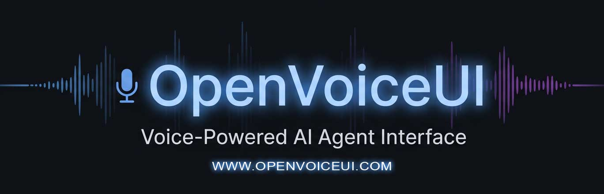

<p align="center">
  
</p>

<h1 align="center">OpenVoiceUI</h1>
<p align="center"><strong>The open-source voice AI that actually does work.</strong></p>

<p align="center">
  <a href="https://www.npmjs.com/package/openvoiceui"></a>
  <a href="LICENSE"></a>
  <a href="https://github.com/MCERQUA/OpenVoiceUI/stargazers"></a>
  <a href="https://openvoiceui.com"></a>
</p>

<p align="center">
  Install, open <code>localhost:5001</code>, say <em>"build me a dashboard"</em>, and watch it render live.
</p>

---

> **[Watch the demo](https://openvoiceui.com)** -- see voice-to-canvas in action

---

## Install

**Prerequisite: [Docker](https://docs.docker.com/get-docker/) must be installed and running for all install methods.**

### Pinokio (one-click)

Download [Pinokio](https://pinokio.co) if you don't have it, then search **"OpenVoiceUI"** in the app store and click **Install**.

### npm

```bash
npx openvoiceui setup     # interactive wizard — walks you through API keys + builds Docker images
npx openvoiceui start     # starts everything
```

### Docker

```bash
git clone https://github.com/MCERQUA/OpenVoiceUI.git
cd OpenVoiceUI
cp .env.example .env        # edit with your API keys
docker compose up
```

Open **localhost:5001** and start talking.

---

## What is OpenVoiceUI?

OpenVoiceUI is a hands-free, AI-controlled computer. You talk — it builds. Live web apps, dashboards, games, full websites — rendered in real time while you watch. No mouse, no keyboard, no typing prompts into a chat box.

It runs on [OpenClaw](https://openclaw.org) and works with any LLM. The AI agent can build and display apps mid-conversation, switch between projects with a voice command, generate music on the fly, delegate work to parallel sub-agents, and remember everything across sessions. It uses any [Claude Code](https://docs.anthropic.com/en/docs/claude-code) or [OpenClaw](https://openclaw.org) skill — and the community can build and share more through the plugin system.

Self-hosted. Your hardware, your data. MIT licensed, forever free.

## Core Features

- **Hands-Free AI Computer** — Talk and watch it work. The AI builds apps, switches between projects, runs tasks, and displays results on a live visual canvas — all without touching a mouse or keyboard.
- **Live Canvas** — AI renders real HTML pages mid-conversation: dashboards, tools, galleries, reports, full web apps. Not text responses — real interactive pages you can use.
- **AI Music Generation** — Generate songs on the fly with your voice using Suno. Full music player with playlist management built in.
- **Custom Animated Interface** — Choose from animated face modes (eye-face avatar, reactive halo-smoke orb) or install community-built faces through plugins. Build your own — the face system is fully extensible.
- **Sub-Agents** — Delegate multiple tasks to parallel AI workers simultaneously and get results back.
- **Long-Term Memory** — Optional context engine plugin curates knowledge every turn. Persists across sessions in human-readable markdown.
- **Desktop OS Interface** — Themed desktop environment with window management (Windows XP, macOS, Ubuntu, Win95, Win 3.1).
- **Admin Dashboard** — Mobile-responsive. Agent profiles, provider config, workspace file browser, plugin management, system health. Everything editable live.
- **Self-Hosted** — Your hardware, your data. No vendor lock-in, no monthly fees.

## And More

- Image generation (FLUX.1, Stable Diffusion 3.5)
- Video creation (Remotion Studio)
- Voice cloning (Qwen3-TTS via fal.ai)
- Cron jobs for scheduled automation
- File explorer with drag-and-drop
- Agent profiles — switch personas, voices, and LLM providers from the admin panel

---

## Install Details

### Option 1: Pinokio (one-click)

1. Install [Pinokio](https://pinokio.co) if you don't have it
2. Search **"OpenVoiceUI"** in the Pinokio app store
3. Click **Install**, then **Start**

Pinokio handles Docker, dependencies, and configuration automatically.

### Option 2: npm

Requires **Node.js 20+**, **Python 3.10+**, and **Docker**.

```bash
npx openvoiceui setup     # interactive wizard — configures LLM, TTS, API keys, builds Docker images
npx openvoiceui start     # starts OpenClaw gateway + Supertonic TTS + voice UI
```

The setup wizard walks you through choosing an LLM provider, TTS provider, and entering API keys. Configuration is saved to `.env` and `openclaw-data/`.

```bash
npx openvoiceui stop      # stop all services
npx openvoiceui status    # check what's running
npx openvoiceui logs      # tail service logs
```

### Option 3: Docker

Requires **Docker** and **Docker Compose**.

```bash
git clone https://github.com/MCERQUA/OpenVoiceUI.git
cd OpenVoiceUI
cp .env.example .env
```

Edit `.env` with your API keys (at minimum: an LLM provider key and optionally a TTS key). Then:

```bash
docker compose up -d
```

This starts three containers:

| Container | Port | Purpose |
|-----------|------|---------|
| `openclaw` | 18791 | LLM gateway — routes to your chosen LLM provider |
| `supertonic` | (internal) | Free local TTS — no API key needed |
| `openvoiceui` | 5001 | Voice UI + Canvas + Admin dashboard |

Open **http://localhost:5001** to use the voice interface, or **http://localhost:5001/admin** for the admin dashboard.

To stop: `docker compose down`

### Option 4: VPS / Production

For running on an Ubuntu server with nginx and systemd:

```bash
git clone https://github.com/MCERQUA/OpenVoiceUI.git
cd OpenVoiceUI
cp .env.example .env               # edit with your API keys
sudo bash deploy/setup-sudo.sh     # creates dirs, installs systemd service
bash deploy/setup-nginx.sh         # generates nginx config (edit domain)
```

See [`deploy/`](deploy/) for the full production setup including SSL, nginx reverse proxy, and systemd service files.

---

## Configuration

All configuration is in `.env`. Copy `.env.example` to `.env` and fill in your values.

**Required:**
- An LLM provider API key (OpenAI, Anthropic, Groq, Z.AI, or any OpenClaw-compatible provider)
- `CLAWDBOT_AUTH_TOKEN` — set during `npx openvoiceui setup` or in OpenClaw's setup wizard

**Optional but recommended:**
- `GROQ_API_KEY` — enables Groq Orpheus TTS (fast, high quality, free tier)
- `SUNO_API_KEY` — enables AI music generation
- `CLERK_PUBLISHABLE_KEY` — enables login/auth (for multi-user or public deployments)

See [`.env.example`](.env.example) for all available options with descriptions.

---

## Works With Any Provider

**LLM**

| Provider | Status |
|----------|--------|
| OpenClaw Gateway | Built-in — routes to OpenAI, Anthropic, Groq, Z.AI, and more |
| Z.AI (GLM-5-turbo) | Built-in |
| Groq (Llama, Qwen) | Via OpenClaw |
| Google Gemini | Via OpenClaw |
| MiniMax | Via OpenClaw |
| Ollama (local) | Via adapter |
| Any LLM | Drop-in gateway plugin |

**Text-to-Speech**

| Provider | Status |
|----------|--------|
| Supertonic (local) | Free, ships with Docker setup |
| Groq Orpheus | Fast cloud TTS, free tier |
| Resemble AI | Premium cloned voices |
| Qwen3-TTS (fal.ai) | Voice cloning |
| Hume EVI | Emotion-aware |
| ElevenLabs | High quality, many voices |

**Speech-to-Text**

| Provider | Status |
|----------|--------|
| Web Speech API | Free, browser-native (default) |
| Deepgram | Streaming, accurate |
| Groq Whisper | Fast cloud transcription |

---

## Admin Dashboard

Access at **localhost:5001/admin**. Mobile-responsive.

- **Profiles** — View and activate agent personas
- **Agent Editor** — Edit name, voice, LLM provider, system prompt, features, and agent workspace files. 4 tabs: Profile, System Prompt, Features, Agent Files
- **Plugins** — Install and manage face packs, gateways, and extensions
- **Canvas Pages** — Toggle public/private, lock pages, delete with archive
- **Workspace Files** — Browse and edit agent workspace. Audio playback, image preview built in.
- **Music (Suno)** — View all generated songs, play inline, archive tracks
- **Provider Config** — Select LLM, TTS, STT providers. Saves to active profile.
- **Health and Stats** — CPU, RAM, disk, gateway status, session reset
- **Connector Tests** — 12 automated endpoint diagnostics

---

## Use Cases

**Small Business** — AI receptionist, appointment scheduler, report builder. Talk to your AI and get a live dashboard of today's leads, reviews, and tasks.

**Digital Agencies** — Deploy custom AI assistants per client. Multi-tenant ready. Each client gets their own voice-powered workspace.

**Developers** — Fork it, extend it, deploy it anywhere. MIT licensed. Build custom plugins, gateway adapters, and canvas pages on top of a voice-first platform.

---

## How It's Different

| | OpenVoiceUI | Typical Voice AI |
|---|---|---|
| **Source** | Open source (MIT) | Closed source |
| **Canvas UI** | Live HTML rendering | Text/audio only |
| **Skills** | Any Claude Code or OpenClaw skill | API endpoints |
| **Music** | AI music generation (Suno) | None |
| **Memory** | Plugin-based long-term context | Session only |
| **Admin** | Full dashboard, mobile-ready | Config files |
| **Plugins** | Community face packs, pages, workflows | None |
| **Hosting** | Self-hosted, your data | Vendor cloud only |
| **Pricing** | Free forever | Per-minute billing |

---

## Tech Stack

| Layer | Technology |
|-------|-----------|
| Backend | Python / Flask |
| Frontend | Vanilla JS (ES modules, no framework) |
| Canvas | Fullscreen iframe + SSE |
| STT | Web Speech API, Deepgram, Groq Whisper |
| TTS | Supertonic, Groq Orpheus, Resemble, Qwen3-TTS |
| LLM | Any provider via OpenClaw gateway |
| Memory | Context engine plugin (markdown knowledge base) |
| Auth | Clerk (optional) |
| Deploy | npm, Docker, Pinokio, VPS/systemd |

---

## Plugins

OpenVoiceUI has a plugin system for community-built extensions. Plugins can include animated face packs, canvas pages, workflow dashboards, gateway adapters, or any combination.

| Plugin | Type | Description |
|--------|------|-------------|
| [**BHB Animated Characters**](https://github.com/MCERQUA/openvoiceui-plugins) | Face Pack | Animated BigHead Billionaires character avatars with lip-sync, mood expressions, and show lore. By [BHaleyart](https://github.com/BHALEYART) |
| **Hermes Agent** | Gateway | Self-improving AI agent with auto-generated skills, deep memory search, and autonomous tasks. Adds OpenClaw+Hermes hybrid and Hermes-only modes |
| **SEO Platform** | Canvas Page | Full SEO dashboard powered by DataForSEO — keyword research, rank tracking, backlink analysis, site audits, AI visibility, and local SEO |
| **Twenty CRM** | Canvas Page | Connect to a Twenty CRM instance for contact, company, deal, and task management with embedded CRM view and setup wizard |
| **ByteRover Long-Term Memory** | Context Engine | Persistent long-term memory that curates conversation knowledge every turn into a human-readable markdown knowledge base |

**Build your own.** Face packs, canvas pages, workflow dashboards, gateway adapters ([template](plugins/README.md)), or STT/TTS adapters ([template](src/adapters/_template.js)). See the [plugins repo](https://github.com/MCERQUA/openvoiceui-plugins) for submission guidelines.

---

## Documentation

- [Introduction](docs/intro.md)
- [Environment Variables](.env.example)
- [Plugin Development](plugins/README.md)
- [Contributing](CONTRIBUTING.md)
- [Website](https://openvoiceui.com)

## Contributing

We welcome contributions — especially plugins. Build a face pack, a canvas page, a workflow dashboard, or a full extension and submit it to the [plugins repo](https://github.com/MCERQUA/openvoiceui-plugins). See [CONTRIBUTING.md](CONTRIBUTING.md) for code contribution guidelines and [openvoiceui.com](https://openvoiceui.com) for full documentation.

## License

[MIT](LICENSE)

---

<p align="center">
  <a href="https://openvoiceui.com">Website</a> &nbsp;&middot;&nbsp;
  <a href="https://github.com/MCERQUA/OpenVoiceUI">GitHub</a> &nbsp;&middot;&nbsp;
  <a href="https://www.npmjs.com/package/openvoiceui">npm</a> &nbsp;&middot;&nbsp;
  <a href="https://github.com/MCERQUA/openvoiceui-plugins">Plugins</a>
</p>
